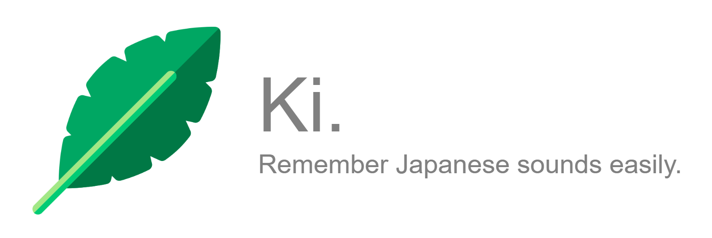

 <p align="center"> 
    
 </p>

# 木 (Ki)

> Easily remember japanese pronounciation with english words you already know!

  Remembering kanji (japanese writing) is hard but sometimes pronounciation can be too.

  Luckily remembering kanji can be tackled using [RtK](https://en.wikipedia.org/wiki/Remembering_the_Kanji_and_Remembering_the_Hanzi) and by building stories about the parts making up the kanji!
  Ki does this but for pronounciation.

  This works by decomposing the sounds of the original japanese word into english words.

  Now you can easily build stories and mnemonics with these new words!
- Check out the online version [here](http://thecakeisalie.pythonanywhere.com)
- ...or keep reading to use it locally

---


## Installation

Ki is built using Python (backend with flask and core algorithm) and JS (frontend with Vuejs). The online version should be a breeze to use but if you want something local, there is also a small python interface you can run yourself.

You can find the online version [here](http://thecakeisalie.pythonanywhere.com)

### Clone

- Clone this repo to your local machine using `git clone https://github.com/ThisCakeIsALie/ki.git`
### Setup

> Install all necessary packages from pip and build the C dependencies.

```shell
$ cd ki/backend
$ pip install -r requirements.txt
$ python setup.py install
```

> And start using it!

```shell
$ python main.py 私
```


---

## How it works

- As input we get kanji and possibly hiragana or katakana (e.g 私)
- We translate it all into hiragana and separate them (e.g わ, た and し)
- The idea of the approximations as english words is to group them back together into groups (e.g. one possibilty would be [わた] and [し])
- For each group generated this way we find a word that looks like the Romanji for the group and one that sounds similar to it (e.g "data" and "water" for [わた])
- We assign a cost to the entire approximation by judging how well the words fit the groups and by how many groups there are (more words are worse for remembering)
- And then we do this for every possible combination of groups and pick the one with the lowest cost
(In a smarter way than just going through all of them one by one so it is not abysmally slow)
- The words approximations of those groups are the ones chosen as the final result!
- If you are interested in details just check out the code! The meat of it is in `approximate.py`

## License

[](http://badges.mit-license.org)

- **[GPL v3.0 License]()**
- Readme adapted from  <a href="https://gist.github.com/fvcproductions/1bfc2d4aecb01a834b46" target="_blank">FVCproductions</a>.
Icons made by <a href="https://www.flaticon.com/authors/freepik" title="Freepik">Freepik</a> from <a href="https://www.flaticon.com/" title="Flaticon"> www.flaticon.com</a>
